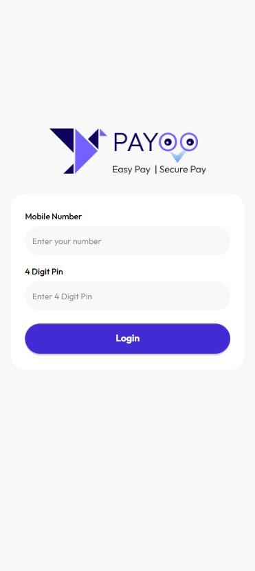
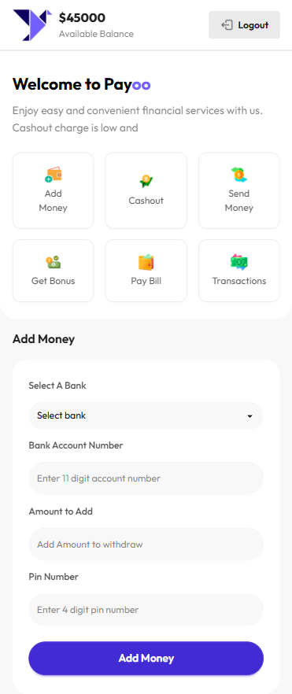

# Payoo

A simple **mobile financial service website** that I built while learning JavaScript and frontend development.

The project includes a login system and basic financial service interactions such as adding money, cashing out, and viewing transaction history.

## Features

* Mobile number and 4-digit PIN login
* Add Money
* Cash Out
* Transaction History
* Balance display
* Logout functionality
* Interactive sections using JavaScript

## Demo Login

**Mobile Number:** `01234567890`
**PIN:** `1234`

> This is a frontend practice project, so the login credentials are only for demonstration purposes.

## Technologies Used

* HTML5
* JavaScript
* Tailwind CSS
* DaisyUI
* Font Awesome

## Live Link

[View Live Website](https://payoo-rust.vercel.app)

## Mobile View

## What I Learned

* Handling form inputs with JavaScript
* Basic login validation
* DOM manipulation
* Event handling
* Updating UI dynamically
* Working with simple transaction logic

### GitHub: [FahmidaAkterShimu](https://github.com/FahmidaAkterShimu)
